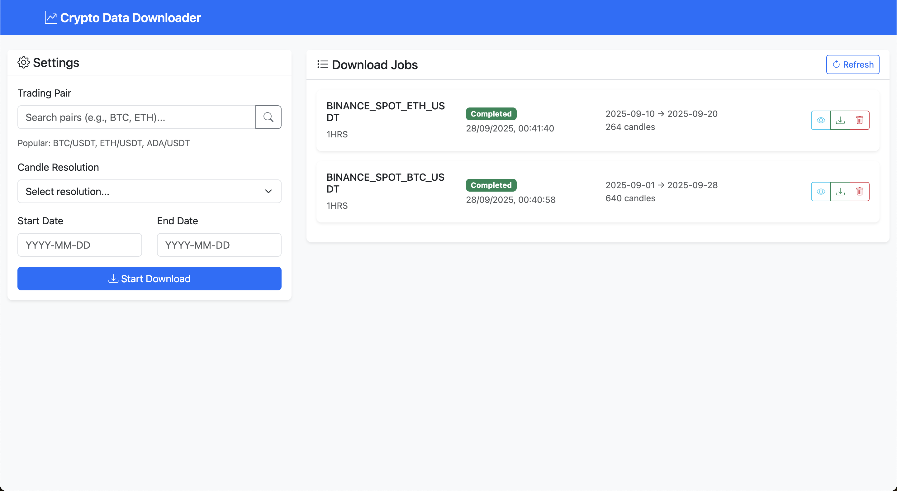
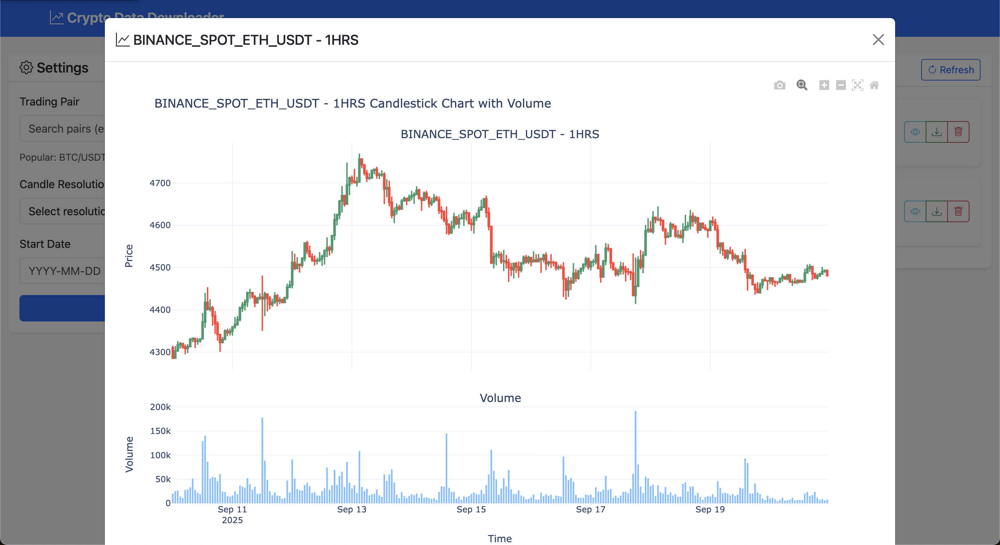

# 🚀 Cryptocurrency Data Downloader

A modern, web-based application for downloading and visualizing cryptocurrency OHLCV (Open, High, Low, Close, Volume) data from multiple providers. Features real-time job tracking, interactive charts, and a clean, responsive interface with support for various cryptocurrency data APIs.



## ✨ Features

### 🌐 **Web Interface**
- Real-time job status updates via WebSocket
- Interactive trading pair search
- Bootstrap-based responsive design

### 📊 **Data Management**
- Multiple timeframes (seconds to years, depending on provider)
- Background job processing with progress tracking
- Persistent storage - jobs survive app restarts
- Automatic missing data detection

### 📈 **Visualization**
- Interactive candlestick charts with volume indicators
- Powered by Plotly for analysis



### 🔧 **Architecture**
- **Modular Design**: Easy to add new data providers (CoinAPI, Binance, Kraken, etc.)
- **Plugin System**: Configurable downloader platforms
- **Provider Agnostic**: Switch between different cryptocurrency data APIs

### 🗂️ **Export**
- CSV format: `time,open,high,low,close,volume,buy_volume,sell_volume`
- **ATS Compatible**: Data format designed for [ATS Automated Trading System](https://github.com/ats-sys/ats) backtesting
- Direct file downloads via web interface

## 🛠️ Quick Start

### Prerequisites
- **Conda** (Miniconda or Anaconda)
- **Cryptocurrency Data API Account** (CoinAPI, Binance, etc. - free tiers available)

### 1. Setup Environment

```bash
# Clone the repository
git clone <your-repository-url>
cd group_project

# Create isolated conda environment
conda create -n crypto_downloader python=3.9 -y
conda activate crypto_downloader

# Install dependencies
pip install -r requirements.txt
```

### 2. Configure API Access

```bash
# Copy environment template
cp .env.template .env

# Edit with your API key
nano .env  # or your preferred editor
```

**Required configuration in `.env`:**
```env
COINAPI_KEY=your_actual_api_key_here  # For CoinAPI provider
PORT=3010
DOWNLOADER_PLATFORM=coinapi  # Options: coinapi, binance (future), etc.
```

### 3. Get Your API Key

**For CoinAPI (Default Provider):**
1. Visit [CoinAPI.io](https://www.coinapi.io/)
2. Create a free account
3. Navigate to your dashboard
4. Copy your API key
5. Paste it into the `.env` file

**For Other Providers:**
- Configure the appropriate API key variable in `.env`
- Set `DOWNLOADER_PLATFORM` to the desired provider
- Refer to provider-specific documentation

### 4. Launch Application

```bash
python app.py
```

🎉 **Success!** Open your browser to: `http://localhost:3010`

## 🔍 Verify Installation

Test your setup with these commands:

```bash
# Check all dependencies
python -c "import requests, pandas, plotly, flask, dotenv; print('✅ All dependencies loaded!')"

# Test app startup
python app.py
```

Look for: `🚀 Starting Crypto Data Downloader on port 3010`

## 📖 Usage

1. **Search** for trading pairs (e.g., "BTC", "ETH")
2. **Select** start/end dates and resolution (1MIN, 1HRS, 1DAY, etc.)
3. **Download** - jobs run in background with real-time progress
4. **View** completed jobs as interactive charts or download CSV files

## 📂 File Structure

```
group_project/
├── app.py                 # Main application entry point
├── requirements.txt       # Python dependencies
├── .env.template         # Environment configuration template
├── .env                  # Your local configuration (create this)
├── README.md             # This file
├── docs/pics/            # Documentation images
├── api/                  # REST API endpoints
├── services/             # Business logic layer
├── downloader/           # Data provider abstractions
├── templates/            # HTML templates
├── static/               # CSS, JavaScript, assets
├── data/                 # Downloaded CSV files
└── local_storage/        # Job persistence storage
```

## ⚙️ Configuration Options

### Environment Variables (`.env`)

| Variable | Default | Description |
|----------|---------|-------------|
| `COINAPI_KEY` | *required* | Your CoinAPI access key (when using CoinAPI) |
| `PORT` | `3010` | Web server port |
| `DATA_FOLDER` | `data` | CSV file storage location |
| `STORAGE_FOLDER` | `local_storage` | Job metadata storage |
| `DOWNLOADER_PLATFORM` | `coinapi` | Data provider platform (coinapi, binance, etc.) |

### Supported Timeframes

*Note: Available timeframes depend on the selected data provider. Below shows CoinAPI examples:*

| Category | Example Resolutions |
|----------|---------------------|
| **Seconds** | 1SEC, 2SEC, 3SEC, 5SEC, 10SEC, 15SEC, 20SEC, 30SEC |
| **Minutes** | 1MIN, 2MIN, 3MIN, 5MIN, 10MIN, 15MIN, 20MIN, 30MIN |
| **Hours** | 1HRS, 2HRS, 3HRS, 4HRS, 6HRS, 8HRS, 12HRS |
| **Days** | 1DAY, 2DAY, 3DAY, 5DAY, 7DAY, 10DAY |
| **Months** | 1MTH, 2MTH, 3MTH, 4MTH, 6MTH |
| **Years** | 1YRS |

## 🔧 Advanced Usage

### Command Line Scripts

For automation and scripting:

```bash
# Interactive command-line downloader
python scripts/crypto_data_downloader.py

# Simple data visualization
python scripts/data_downloader.py
```

### Adding New Data Providers

The application is designed for easy extension:

1. Create new downloader class in `downloader/`
2. Implement `BaseDownloader` interface
3. Update `DownloaderFactory`
4. Configure via `DOWNLOADER_PLATFORM`

Example providers ready for implementation: Binance, Kraken, Coinbase

## 🐛 Troubleshooting

### Common Issues

**"No module named 'dotenv'"**
```bash
conda activate crypto_downloader
pip install python-dotenv
```

**"API key not configured"**
- Ensure `.env` file exists
- Check the appropriate API key is set for your provider
- Verify no extra spaces or quotes
- Confirm `DOWNLOADER_PLATFORM` matches your provider

**"Port 3010 already in use"**
```bash
# Change port in .env
PORT=3011

# Or kill existing process
lsof -ti:3010 | xargs kill -9
```

**"Only 100 candles downloaded"**
- This is normal for some time periods
- The app automatically calculates optimal limits
- Larger date ranges = more candles

### Getting Help

1. Check the console output for detailed error messages
2. Verify your API key has sufficient credits/quota
3. Ensure your internet connection is stable
4. Try with smaller date ranges first
5. Check that your selected provider supports the requested timeframe

## 📊 Data Format

Downloaded CSV files use a standardized format compatible with the [ATS Automated Trading System](https://github.com/ats-sys/ats) for seamless backtesting integration:

```csv
time,open,high,low,close,volume,buy_volume,sell_volume
2025-01-01 00:00:00+00:00,65432.1,65890.5,65123.8,65678.9,1234.56,567.89,666.67
```

- **Time**: ISO format with timezone
- **OHLC**: Price data in quote currency  
- **Volumes**: Trading volume data
- **ATS Ready**: Direct import into ATS backtesting engine

## 📄 License

This project is licensed under the Apache License 2.0 - see the [LICENSE](LICENSE) file for details.

## 🤝 Contributing

Areas for improvement:
- **Additional data providers** (Binance, Kraken, Coinbase Pro)
- **Enhanced charting features** (technical indicators, overlays)
- **API rate limiting optimizations**
- **Provider-specific features** (WebSocket streaming, etc.)

---

**Built with**: Python, Flask, Bootstrap, Plotly